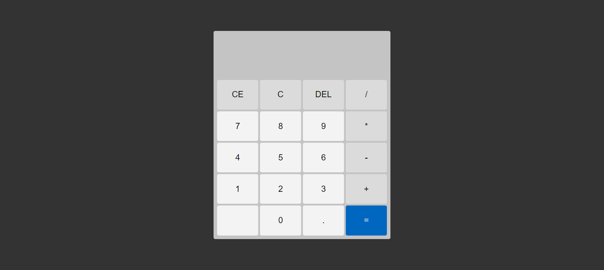

<h1 align="center">
  Calculadora do Windows
</h1>

  

## Projeto - Calculadora do Windows

Este site emula a interface de uma calculadora do Windows 11, proporcionando aos usuários a capacidade de executar operações matemáticas fundamentais,
como adição, subtração, multiplicação e divisão.
Sua funcionalidade se assemelha à de uma calculadora de desktop do Windows.

Tecnologias Utilizadas:
* [HTML (Linguagem de marcação):](https://www.w3schools.com/html/html_intro.asp) Utilizado para estruturar e definir o conteúdo da página, incluindo cabeçalhos, parágrafos, listas e imagens.
* [CSS (Folha de estilos em cascata):](https://www.w3schools.com/css/css_intro.asp) Utilizado para estilizar os elementos da página, definindo cores, tamanhos, fontes e layout, proporcionando uma aparência visualmente atraente.
* [JavaScript:](https://developer.mozilla.org/pt-BR/docs/Web/JavaScript) Utilizado para adicionar interatividade à página, permitindo que o usuário selecione personagens e exiba informações dinamicamente.
* [GitHub Pages:](https://pages.github.com/) Plataforma de hospedagem gratuita para projetos estáticos, permitindo que o site seja acessível na web.

Créditos:
* Criado com base do Canal no YouTube | [Matheus Battisti - Hora de Codar](https://www.youtube.com/@MatheusBattisti)

Implantação do Projeto no GitHub Pages: [Explore o projeto clicando aqui.](https://jcddsj01.github.io/calculadora-windows/)

---

## Project - Windows calculator

This site emulates the interface of a Windows 11 calculator, giving users the ability to perform fundamental mathematical operations,
such as addition, subtraction, multiplication and division.
Its functionality resembles that of a Windows desktop calculator.

Technologies used:
* [HTML (HyperText Markup Language):](https://www.w3schools.com/html/html_intro.asp) Used to structure and define page content, including headings, paragraphs, lists and images.
* [CSS (Cascading Style Sheets):](https://www.w3schools.com/css/css_intro.asp) Used to style the elements of the page, defining colors, sizes, fonts and layout, providing a visually appealing appearance.
* [JavaScript:](https://developer.mozilla.org/pt-BR/docs/Web/JavaScript) Used to add interactivity to the page, allowing the user to select characters and display information dynamically.
* [GitHub Pages:](https://pages.github.com/) Free hosting platform for static projects, allowing the website to be accessible on the web.

Credits:
* Created on the basis of the YouTube channel | [Matheus Battisti - Hora de Codar](https://www.youtube.com/@MatheusBattisti)

Project deployment on GitHub Pages: [Explore the project by clicking here.](https://jcddsj01.github.io/calculadora-windows/)
